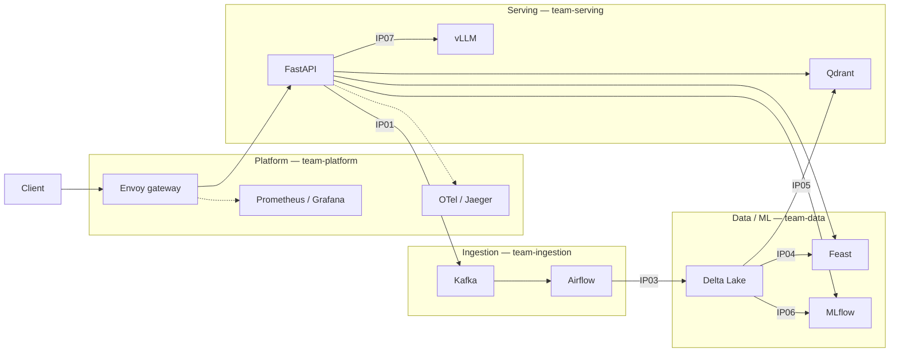

# ANSWERS — Day 28 Track 2

Sinh viên: Nông Ngọc Dương (`2A202601296`). Làm cá nhân.

Bằng chứng sống nằm ở `submission/` (bản copy có thể commit). Thư mục `evidence/` cùng nội dung nhưng bị `.gitignore` đúng quy định runtime.

## 1. Phạm vi đã hoàn thành

Phần mã bắt buộc: `src/lab28_platform/integration_tasks.py`.

| Hàm | IP | Việc đã làm |
|---|---|---|
| `event_headers` | IP01, IP10 | Header Kafka dạng bytes: luôn `idempotency-key`; chỉ gửi `traceparent` khi có trace |
| `dedupe_latest` | IP03 | Một event mới nhất mỗi khóa theo `(occurred_at, event_id)`, sắp theo `idempotency_key` |
| `feast_online_request` | IP04 | Lấy `FEATURE_REFS` từ `contracts.py` |
| `readiness_status` | IP07, IP08 | `not_ready` / `degraded` / `ready` theo probe bắt buộc vs tùy chọn |

### Kiểm tra tĩnh

`submission/fast-suite.txt`, `submission/k8s-gitops-validation.txt`

```text
pytest starter-tests tests -q   →  87 passed
ruff check .                    →  All checks passed
scripts/verify_matrix.py        →  245 checks
scripts/check_portability.py    →  OK
scripts/validate_manifests.py   →  Kubernetes and GitOps manifest contracts passed
```

### Stack Compose cơ bản (đã chạy trên máy này)

`docker compose --env-file ports.template up -d --build` — không `--profile full` vì Docker Desktop VM ~4 GiB RAM.

| Bước | Kết quả |
|---|---|
| `lab28 topics` | 4 topic created |
| `lab28 index --source file` | 13 points Qdrant |
| `lab28 release` | `lab28-rag-release` v1 champion, run `d5a5321fb97847c6aa9a32ee6ed96504` |
| `lab28 seed --via-gateway` | 13 documents 202; 8 feedback 202; 4 feedback **429** |
| Gateway `/ready` | `degraded` (vLLM không có GPU) |
| Promote v2 rồi `lab28 rollback` | champion trở lại **v1** |

Sơ đồ kiến trúc: `docs/images/lab28-architecture-overview.svg`. Ownership ở mục 3.

## 2. Trade-offs

### Headers Kafka: omit hơn là gửi rỗng

`event_headers` không gửi `traceparent` rỗng. Header W3C không hợp lệ làm collector/Jaeger tách trace. Live: `submission/ip01-kafka-consume.json` có `traceparent` `00-b5f4bc292d05051b0eccc249e2bf3ee8-...`.

### Dedup trước MERGE

Delta MERGE sập nếu source trùng `idempotency_key`. So `(occurred_at, event_id)` vì Kafka không bảo đảm thứ tự trong một batch poll. Chưa có Spark trên máy này nên IP03 lakehouse = `UNVERIFIED`; unit test `tests/test_delta_merge_idempotency.py` đã pass.

### Feast không bắt buộc trên `/ready`

Inject `docker compose stop feast` → status vẫn `degraded`, không 503 toàn pod. Start lại → Feast `ready: true`, Qdrant vẫn 13 points. File: `submission/failure-recovery.json`.

### Alias MLflow, không dùng stage

Release v2 (`673c57f2ffb54c80bab3fd47f7e03c58`) rồi `lab28 rollback` đưa alias `champion` về v1 (`d5a5321fb97847c6aa9a32ee6ed96504`). Không sửa image.

### vLLM thật, không mock

`ip07-vllm-identity.json`: `is_real_vllm: false`, `unreachable`. Compose API đặt `LAB28_VLLM_REQUIRE_REAL=false` nên `/ready` qua gateway là `degraded`, không giả OpenAI server.

### GitOps pin tag + self-heal

`gitops/application.yaml` pin `refs/tags/v3.0.0`, `prune: true`, `selfHeal: true`. Manifest không `:latest`, non-root, probes `/health` và `/ready`.

### Offset commit sau xử lý bền

Consumer tắt auto-commit. Poison message vào DLQ. At-least-once + idempotency, không exactly-once broker.

### Qdrant ID ổn định

13 document index từ file; hybrid search trả `doc_id` + score. Re-index sẽ ghi đè cùng UUID.

## 3. Architecture và ownership

Luồng: Client → Envoy (IP08) → FastAPI → Kafka `data.raw` (IP01) → Airflow (IP02) → Spark Delta MERGE (IP03) → Feast (IP04) / Qdrant (IP05) / MLflow (IP06) → vLLM (IP07). Trace W3C (IP10), Prometheus (IP09).



| Thành phần | Owner | IP |
|---|---|---|
| Kafka, Airflow, DLQ | team-ingestion | IP01–IP02 |
| Delta, Feast, MLflow | team-data | IP03–IP04, IP06 |
| Qdrant, FastAPI, vLLM | team-serving | IP05, IP07 |
| Envoy, Prometheus, Grafana, OTel, K8s/GitOps | team-platform | IP08–IP10 |

Làm cá nhân nên một người kiêm mọi vai.

## 4. Production gaps

1. **vLLM / IP07:** `UNVERIFIED` — không GPU. Không mock. Cần Kaggle/cluster (`KAGGLE_GPU_EXTENSION.md`).
2. **Airflow + Spark / IP02–IP03:** `UNVERIFIED` live — Docker VM ~4 GiB, không bật `--profile full`.
3. **Feast features:** server healthy, entity `asker-001` PRESENT, feature values `NOT_FOUND` vì chưa materialize từ Delta.
4. **LangSmith:** không có `LANGSMITH_API_KEY` → chân LangSmith `UNVERIFIED`. Jaeger local đã có trace.
5. Guardrail PII là regex, không phải DLP.
6. Envoy lab: local rate limit 10 req/s, chưa OIDC/mTLS.
7. Kafka `replication_factor: 1`.
8. MLflow SQLite trong volume Compose.
9. Alert: API down 30s, error ratio > 5%/2 phút; chưa SLO burn-rate.
10. Load status `0` = timeout khi bão hòa gateway (xem mục 7).

## 5. Kubernetes / GitOps / rollback

`scripts/validate_manifests.py` pass. Có Deployment, Service, ServiceAccount, ConfigMap, HPA, PDB, NetworkPolicy, Gateway API v1, HTTPRoute.

- Image pin `ghcr.io/vinuni-ai20k/day28-platform-api:3.0.0`
- `runAsNonRoot`, drop ALL capabilities, read-only rootfs
- Liveness `/health`, readiness `/ready`, startup probe
- Argo CD không trỏ `HEAD`/`main`

Rollback mô hình: `lab28 rollback` — đã chạy, champion = v1.

Rollback GitOps: đổi `targetRevision` / image tag trong Git → Argo sync. Không `lab28 reset --yes` khi recovery.

## 6. Failure / recovery (đã inject Feast)

Xem `submission/failure-recovery.json`.

| Thời điểm | `/ready` | Feast | Qdrant | MLflow |
|---|---|---|---|---|
| Feast stop | `degraded` | false / ConnectError | 13 points | v1 champion |
| Feast healthy lại | `degraded` (vì vLLM) | true / ok | 13 points | v1 champion |

Không mất dữ liệu: point count không đổi, topic Kafka còn, alias champion không đổi. Không dùng `down -v`.

## 7. Load profile

`submission/load-profile.json` — `GET http://localhost:8080/ready`, 200 requests, 8 workers:

| | |
|---|---|
| P50 | 667 ms |
| P95 | 1131 ms |
| P99 | 1332 ms |
| HTTP 200 | 133 |
| status 0 (timeout/kết nối) | 67 |

Bottleneck: Envoy local rate limit 10 token/giây (`gateway/envoy.yaml`) + `/ready` probe vài dependency (P50 đã ~0.7s). Burst 40 × `/healthz` cho 28 × HTTP 429 (`x-lab28-rate-limited: true`). Đó đúng hành vi IP08, không phải lỗi API.

## 8. Evidence theo từng IP

| IP | File | Trạng thái live |
|---|---|---|
| IP01 | `submission/ip01-kafka-consume.json` | **Đạt** — `data.raw` + `traceparent` + `idempotency-key` |
| IP02 | `submission/ip02-airflow-run.json` | UNVERIFIED — cần `--profile full` |
| IP03 | `submission/ip03-delta-history.json` | UNVERIFIED lakehouse; unit test MERGE đã pass |
| IP04 | `submission/ip04-feast-online.json` | Server 200; features `NOT_FOUND` (chưa materialize) |
| IP05 | `submission/ip05-qdrant-search.json` | **Đạt** — 13 points, hybrid scores |
| IP06 | `submission/ip06-mlflow-release.json` + `rollback.json` | **Đạt** — v1 champion; v2 rồi rollback về v1 |
| IP07 | `submission/ip07-vllm-identity.json` | UNVERIFIED — không vLLM thật |
| IP08 | `submission/ip08-gateway.json` | **Đạt** — 200 + `x-request-id`; 429 + `x-lab28-rate-limited` |
| IP09 | `submission/ip09-prometheus-targets.json` | **Đạt** — mọi job core `up`; `lab28-vllm-optional` down |
| IP10 | `submission/ip10-trace.json` | **Một phần** — cùng `trace_id` `ba5bfc0eb990090fa23bce6a558e0a7b`; span `lab28.gateway.request`, `lab28.api.ingest`, `lab28.kafka.produce`. Thiếu consume/Airflow/Spark/ask/vLLM |

Happy-path IDs để demo:

- Trace: `ba5bfc0eb990090fa23bce6a558e0a7b` — Jaeger <http://localhost:16686/trace/ba5bfc0eb990090fa23bce6a558e0a7b>
- MLflow run: `d5a5321fb97847c6aa9a32ee6ed96504` — <http://localhost:5000>
- Qdrant: 13 points, collection `lab28_documents`
- Delta version: không có (chưa Spark)
- `integration-report.json`: 4/6 verified points passing, score 67 (IP03/IP07 not_ready; IP02/08/09/10 unverified từ process serving)

Khi có máy ≥ 12 GiB RAM + GPU:

```text
docker compose --env-file ports.template --profile full up -d --build --wait
uv run pytest integration-tests -m "not gpu and not langsmith" -q
```

## 9. Contribution

Làm cá nhân: bốn hàm, fast suite, Compose core, seed/index/release/rollback, evidence pack, failure injection Feast, load profile, và file reflection này.

## 10. Kết luận sẵn sàng

- **Code + 87 test + Ruff + matrix + portability + K8s/GitOps:** đạt.
- **Live core:** IP01, IP05, IP06, IP08, IP09 đạt; IP10 một phần; `/ready` = `degraded` đúng vì không GPU.
- **IP02, IP03 lakehouse, IP04 feature values, IP07, J1–J5 full, LangSmith:** `UNVERIFIED`, không giả vLLM/trace/Delta.
- Stack vẫn có thể đang chạy trên `localhost:8080` (gateway), `:3000` Grafana, `:16686` Jaeger, `:5000` MLflow. Dừng: `docker compose --env-file ports.template down --remove-orphans`.
